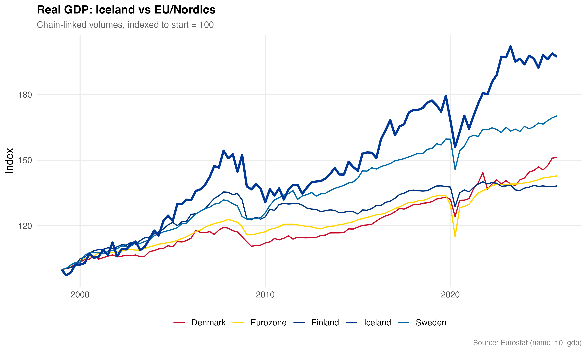
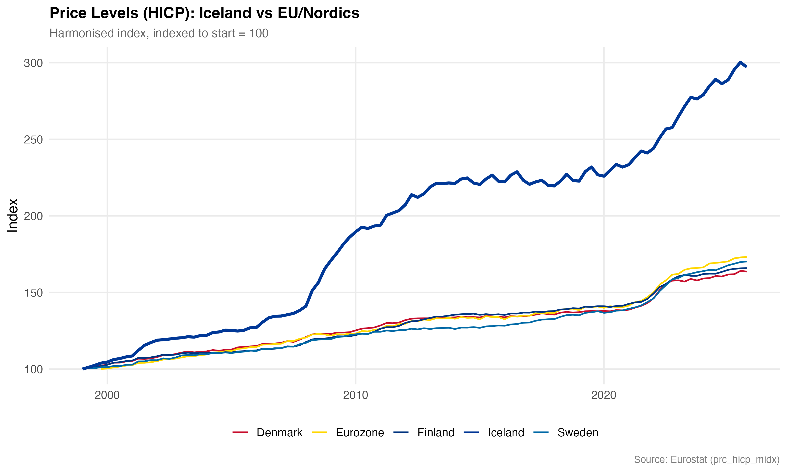
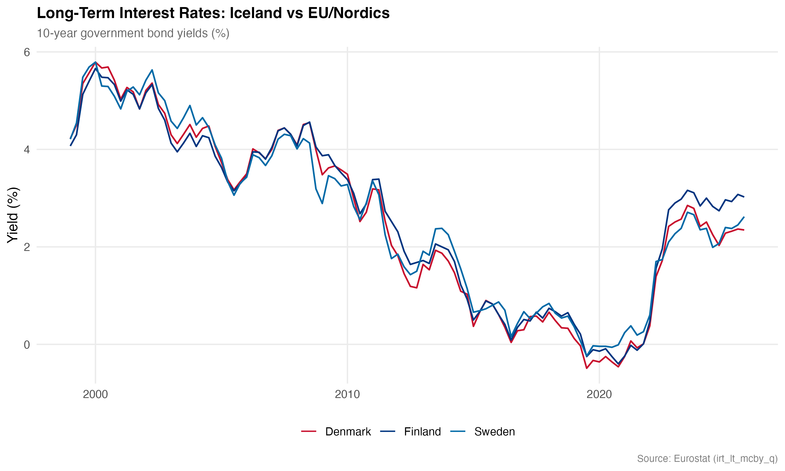
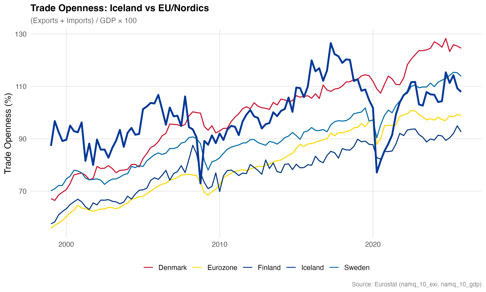
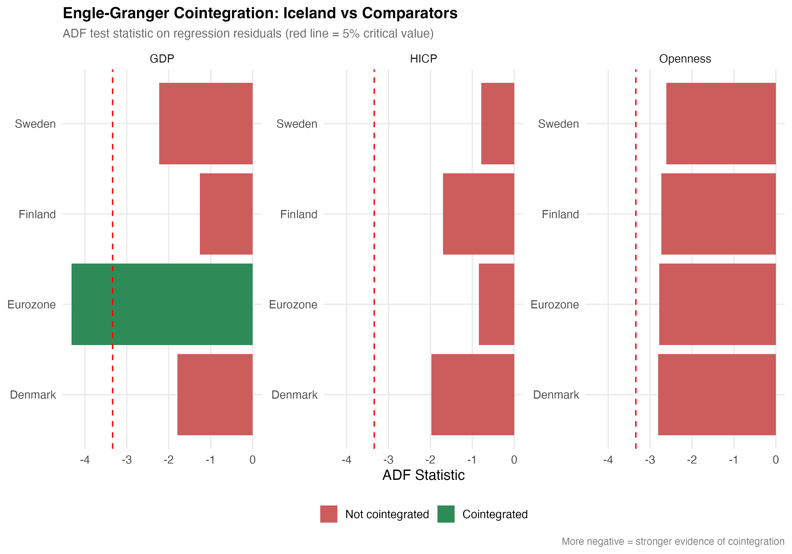

```{r}
#| label: setup
#| include: false
library(tidyverse)
library(knitr)
library(kableExtra)

adf_results      <- read_csv("output/cointegration/adf_results.csv", show_col_types = FALSE)
adf_diff_results <- read_csv("output/cointegration/adf_diff_results.csv", show_col_types = FALSE)
kpss_results     <- read_csv("output/cointegration/kpss_results.csv", show_col_types = FALSE)
eg_results       <- read_csv("output/cointegration/eg_results.csv", show_col_types = FALSE)
johansen_results <- read_csv("output/cointegration/johansen_results.csv", show_col_types = FALSE)
```

## Inngangur

Samþættingargreining (*cointegration analysis*) prófar hvort tímaraðir deili langtímajafnvægi þrátt fyrir skammtímasveiflur. Ef tvær hagstærðir eru samþættar þýðir það að þær sveiflist ekki í sundur til lengri tíma litið — frávik frá jafnvægi eru tímabundin og leiðréttast.

Við prófum fjórar hagstærðir: vergri landsframleiðslu (GDP), samræmda vísitölu neysluverðs (HICP), langtímavexti og viðskiptaopnun. Greiningin skiptist í þrjú stig: einingarrótarprófanir, Engle-Granger tvíbreytupróf og Johansen fjölbreytupróf.

---

## Niðurstöður

<!-- ================================================================ -->
<!-- PLACEHOLDER: Skrifaðu hér niðurstöðurnar á íslensku.             -->
<!--                                                                  -->
<!-- Leiðbeiningar: Sjá notes/cointegration_results.md fyrir          -->
<!-- ítarlega lýsingu á niðurstöðunum á ensku.                        -->
<!--                                                                  -->
<!-- Uppbygging sem þú gætir fylgt:                                   -->
<!--   1. Einingarrótarprófanir: staðfesta I(1)-eiginleika            -->
<!--   2. Engle-Granger: hvað fannst, hvað fannst ekki                -->
<!--   3. Johansen: hvað bætir þetta við?                             -->
<!--   4. Heildarmynd: hvað segja niðurstöðurnar um ESB-spurninguna?  -->
<!-- ================================================================ -->

---

## Gögn

Myndir @fig-gdp til @fig-openness sýna þróun hverrar hagstærðar. GDP og HICP eru sett á sama grunn (vísitala = 100 við upphaf tímabilsins) til að auðvelda samanburð.

::: {layout-ncol=2}
{#fig-gdp}

{#fig-hicp}
:::

::: {layout-ncol=2}
{#fig-interest}

{#fig-openness}
:::

---

## Viðauki: Töflur og tæknileg atriði

### Einingarrótarprófanir

Forsenda samþættingargreiningar er að tímaraðirnar séu I(1): óstöðugar í stigum en stöðugar í fyrstu mismunum. Við notum ADF-próf (núlltilgáta: einingarrót) og KPSS-próf (núlltilgáta: stöðugleiki) sem gagnvirk staðfesting.

**ADF-próf á stigum** — I(1) = TRUE þýðir að ekki er hægt að hafna einingarrót við 5%.

```{r}
#| label: tbl-adf
adf_results |>
  mutate(across(where(is.numeric), ~round(.x, 2))) |>
  kable(
    col.names = c("Röð", "ADF", "1%", "5%", "10%", "Lags", "I(1)"),
    booktabs = TRUE
  ) |>
  kable_styling(full_width = FALSE, font_size = 12)
```

**ADF-próf á fyrstu mismunum** — I(1) = FALSE staðfestir stöðugleika eftir mismunun.

```{r}
#| label: tbl-adf-diff
adf_diff_results |>
  mutate(across(where(is.numeric), ~round(.x, 2))) |>
  kable(
    col.names = c("Röð", "ADF", "1%", "5%", "10%", "Lags", "I(1)"),
    booktabs = TRUE
  ) |>
  kable_styling(full_width = FALSE, font_size = 12)
```

**KPSS-próf á stigum** — Höfnun (TRUE) þýðir óstöðugleika, staðfestir ADF-niðurstöður.

```{r}
#| label: tbl-kpss
kpss_results |>
  mutate(across(where(is.numeric), ~round(.x, 2))) |>
  kable(
    col.names = c("Röð", "KPSS", "Markgildi 5%", "Hafna H₀"),
    booktabs = TRUE
  ) |>
  kable_styling(full_width = FALSE, font_size = 12)
```

### Engle-Granger samþættingarpróf

Markgildi við 5% er −3,34. Neikvæðari ADF-gildi á leifum = sterkari vísbending um samþættingu.

```{r}
#| label: tbl-eg
eg_results |>
  mutate(
    beta = round(beta, 3),
    r_squared = round(r_squared, 3),
    adf_resid = round(adf_resid, 2)
  ) |>
  select(-eg_crit_5pct) |>
  kable(
    col.names = c("Par", "Beta", "R²", "ADF leifa", "Samþætt"),
    booktabs = TRUE
  ) |>
  kable_styling(full_width = FALSE, font_size = 12)
```



### Johansen samþættingarpróf

Tvær hópasamsetningar til að koma í veg fyrir fjöllínulega tengingu (EA20 skarast við Norðurlöndin):

- **Ísland + Evrusvæðið** — svarar beint ESB-spurningunni
- **Norræni hópurinn** — Ísland + Danmörk + Svíþjóð + Finnland

```{r}
#| label: tbl-johansen
johansen_results |>
  mutate(across(where(is.numeric), ~round(.x, 2))) |>
  kable(
    col.names = c("Próf", "r=0 stærð", "r=0 mark. 5%", "r=1 stærð", "r=1 mark. 5%", "Rank"),
    booktabs = TRUE
  ) |>
  kable_styling(full_width = FALSE, font_size = 12)
```
